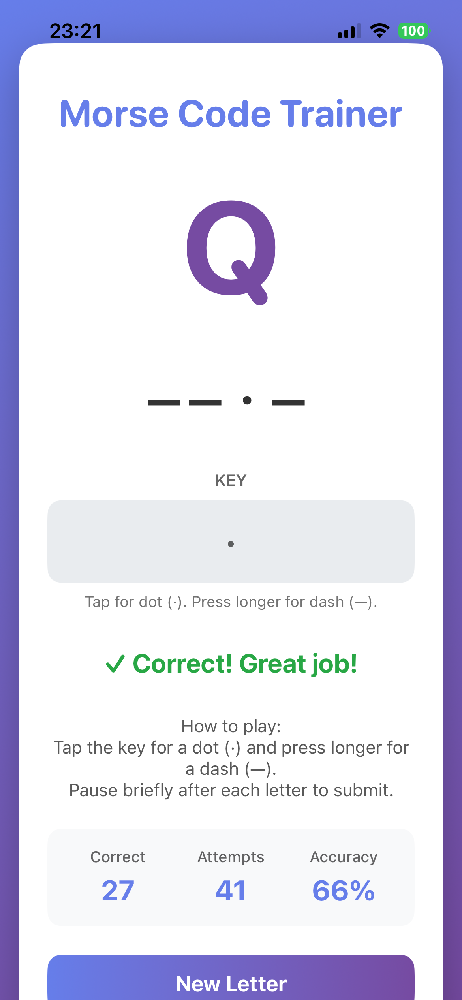
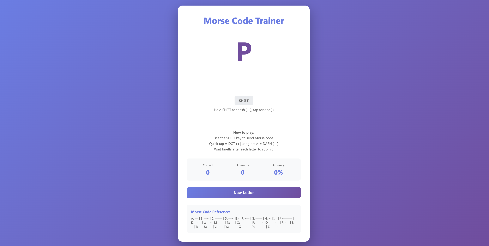

# Morse Code Trainer

An interactive application to learn and practice Morse code with audio and haptic feedback. Features both iOS (SwiftUI) and web versions for practicing anywhere.

## Features

- **Interactive Morse Code Practice**: Learn and master Morse code sequences
- **Audio Feedback**: Play Morse code tones (dots and dashes) with realistic sound
- **Haptic Feedback**: Feel the rhythm through device vibrations (iOS)
- **Responsive UI**: Clean, modern interface for better learning experience
- **Cross-Platform**: Available on iOS and web

## How It Works

The app presents Morse code sequences and allows you to practice:
1. Listen to Morse code tones and haptic patterns
2. Tap or click to input your own Morse code responses
3. Get immediate feedback on your accuracy
4. Practice different letters and symbols with customizable difficulty

## Technologies

### iOS App
- **SwiftUI**: Modern declarative UI framework
- **AVFoundation**: Audio playback for Morse code tones
- **CoreHaptics**: Device haptic feedback
- **MVVM Architecture**: Clean separation of concerns with TrainerViewModel

### Web App
- HTML/CSS/JavaScript

## Project Structure

```
MorseCode/
├── MorseCodeApp.swift          # App entry point
├── ContentView.swift           # Main UI container
├── TrainerViewModel.swift      # Game logic and state management
├── MorseKeyView.swift          # Morse code input key UI
├── MorseAlphabet.swift         # Morse code mapping for letters/numbers
├── TonePlayer.swift            # Audio playback engine for tones
├── HapticPlayer.swift          # Haptic feedback controller
└── Assets.xcassets/            # Color scheme and app assets
```

## Getting Started

### iOS App
1. Open `MorseCode.xcodeproj` in Xcode
2. Select the target device or simulator
3. Build and run using Cmd+R

### Web App
Open `index.html` in a modern web browser

## UI

### iOS App


### Web App


## License

Licensed under the MIT License – see [LICENSE](LICENSE) file for details


